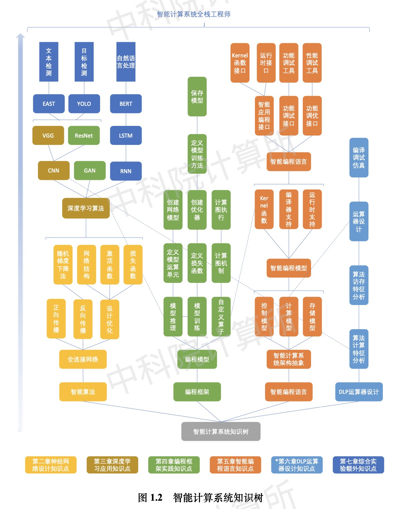
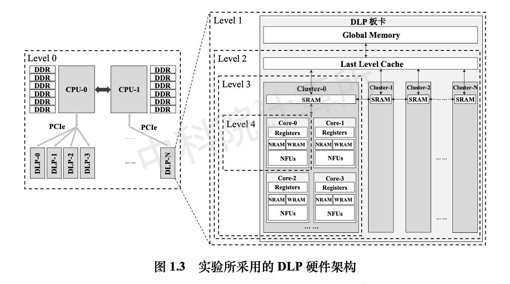
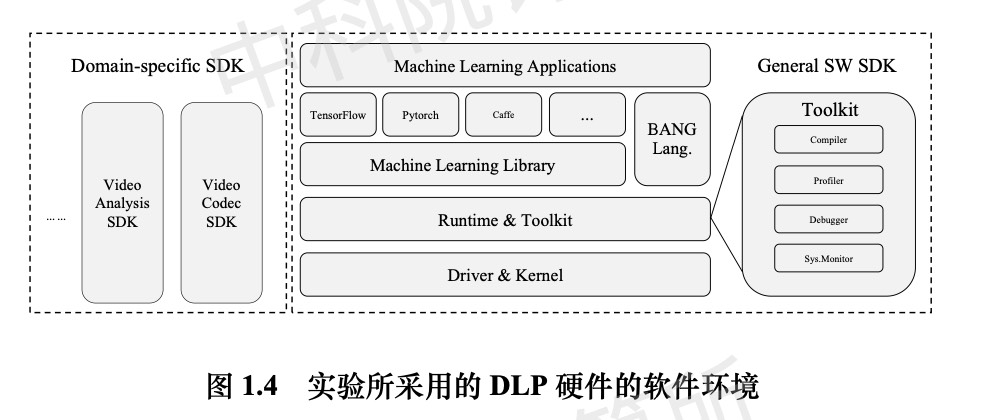

# 智能计算系统 AI Computing Systems

## Introduction

- 所属大学：中国科学院 计算技术研究所
- 授课老师：陈云霁
- 先修要求：体系结构，深度学习
- 编程语言：Python, C++, BCL
- 课程难度：🌟🌟🌟
- 预计学时：100 小时+
- 学年：2020 春季学期

《智能计算系统》是一门全面贯穿人工智能整个软硬件技术栈的系统性课程，课程采用“全栈贯通，应用驱动”的核心理念，以一个图像风格迁移的驱动范例带动，重点围绕智能计算系统的设计理论、方法、关键技术等展开讨论，从基本概念开始，由浅入深帮助学生建立智能计算系统设计及应用的知识体系，培养智能时代急需的芯片设计、软件开发、算法研发等各个层次的人才。

本课程为核心专业类实训课程，旨在培养学生对智能计算系统完整软硬件技术栈（**包括基础智能算法、智能计算编程框架、智能计算编程语言、智能芯片体系结构等**）融会贯通的理解，帮助学生能够：

- 理解智能计算系统的基本概念和基本理论，实现对智能计算软硬件技术栈的贯通理解；
- 应用神经网络进行模型训练，了解深度学习算法并利用深度学习编程框架设计网络；
- 了解智能芯片的基本架构，并能够结合这些知识使用智能计算系统，了解智能芯片解决智能任务的原理；
- 初步具备使用智能计算系统软件工具满足实际场景需求的能力，并通过实践环节培养设计、开发智能应用软件的能力。

国内的陈云霁老师开的课，在其他若干个大学也都有开对应的课程。这门课用一个个实验带大家以一个完整的视野理解人工智能的技术栈。**从上层的深度学习框架，到用底层语言编写算子，再到硬件中 MLU 的设计**，让大家形成系统思维，体会自上而下，融会贯通的乐趣。

---

个人感觉，这门课非常系统；

有一定基础的，前四章不用听，从第五章往后才是有意思的内容，但是也不建议听；

陈老师很 nb，讲课一般，语速慢，睡得真的香，得 1.25 倍速听也能睡着；

附带的实验很 nb，几乎包含了一个 ai 系统的所有。

## Resources

- 课程网站：[官网](https://novel.ict.ac.cn/aics/)
- 课程视频：[bilibili](https://space.bilibili.com/494117284)
- 课程教材：智能计算系统（陈云霁）
- 课程作业：6 个实验(包括编写卷积算子，为 TensorFlow 添加算子，用 BCL 编写算子并集成到 TensorFlow 中等)(具体内容在官网可以找到)
- 实验手册：https://novel.ict.ac.cn/aics/wjxz/sywd/
- 学习笔记：https://sanzo.top/categories/AI-Computing-Systems/，参考实验手册总结的笔记
- 参考 lab：在学习这门课中用到的所有资源和作业实现都汇总在 [ysj1173886760/Learning: ai-system - GitHub](https://github.com/ysj1173886760/Learning/tree/master/ai-system) 中

## Labs

结合智能计算系统的软硬件技术栈，本书设计了如图所示的分阶段实验和综合实验。

其中，分阶段实验以图像风格迁移作为驱动范例，通过逐步完成**算法实验**（第 2-3 章）、 **编程框架实验**（第 4 章）、**智能编程语言实验**（第 5 章）、**DLP 运算部件实验**（第 6 章）等， 点亮知识树（如图1.2所示），开发出实现图像风格迁移的智能计算系统；

综合实验包括**目标检测、文本检测、自然语言处理**等不同应用领域的实验，巩固对相关知识的系统理解和 掌握，了解不同应用对智能计算系统的需求，并开发出相应的智能计算系统，进阶为智能计算系统全栈工程师。

### 第 2 章 基础算法实验

利用三层全连接神经网络实现手写数字分类的两个实验，包括在 CPU 平台和 DLP 平台上实现手写数字分类，以帮助读者深入理解神经网络训练及预测原理。

[**实验一：实现神经网络的基本单元**](./labs/exp_2_1_mnist_mlp/)

采用 Python 语言实现神经网络的基本单元，包括全连接层、激活函数、损失函数（涉及知识可参考《智能计算系统》教材第 2.3 节），该实验有助于理解神经网络中正向 传播和基于随机梯度下降法的反向传播的原理及计算复杂度（涉及知识可参考《智能计算 系统》教材第 2.2 节）

此外，通过训练一个简单完整的神经网络，以帮助读者理解隐层个 数、神经元数、激活函数、损失函数和学习率等对网络训练及分类精度的影响。通过对网 络层的作用及层间关系的深入理解，为后续更复杂的综合实验（如风格迁移等）奠定基础。

[**实验二：神经网络前向相关的模块移植到 DLP 平台**](./labs/exp_2_2_mnist_mlp_dlp/)

调用 DLP 上 Python 语言封装的深度学习编程库 pycnml，将实验一中神经网络前向 相关的模块移植到 DLP 平台上，最终在 DLP 平台上实现手写数字分类。通过该实验，读 者可以对 DLP 编程和处理效率有初步了解。

### 第 3 章 深度学习算法

包括 CPU 平台、DLP 平台上的 VGG 图像 分类以及非实时风格迁移等。其中，VGG 是风格迁移应用中用到的深度学习算法，涉及到 卷积层、池化层、全连接层、softmax 损失函数等

[**实验一： VGG 图像分类实验**](./labs/exp_3_1_vgg/)

主要面向如何用 Python 实现 VGG 网络 结构、加载模型参数、模型分类测试，并分析 VGG 网络的计算量及性能瓶颈，为风格迁移实验中使用 VGG 网络计算风格特征相似度做准备。

[**实验二： DLP 平台的图像分类实验**](./labs/exp_3_2_vgg_dlp/)

需要调用 pycnml 库中的相关接口将实验一中的相关模块移植到 DLP 平台上，最终在 DLP 平台上实现图像分类。

[**实验三：非实时风格迁移实验**](./labs/exp_3_3_style_transfer/)

利用 VGG 对输入图像进行训练来获得风格化后的图像，包括如何用 VGG 网络提取图像特征，如何计算内容/风格损失，如何迭代训练来求解风格化图像等。

### 第 4 章 深度学习编程框架

包括利用编程框架实现图像分类、利 用图像转换网络预测实现实时风格迁移、图像转换网络的训练、编程框架的 CPU 自定义算子

[**实验一：图像分类实验**](./labs/exp_4_1_vgg19_student/)

如何利用 TensorFlow 框架实现 CPU 和 DLP 两种 平台上的图像分类，帮助读者熟悉 TensorFlow 的编程模型及基本用法。

[**实验二：实时风格迁移预测实验**](./labs/exp_4_2/)

在实验一的基础上基于 TensorFlow 实现实时风格迁移中图像转换网络的预 测。其中涉及多种网络层的定义、神经网络模型的创建、模型参数的加载、神经网络模型 的计算及输出等。

[**实验三：实时风格迁移训练实验**](./labs/exp_4_3/)

基于 TensorFlow 实现图像转换网络的 训练，包括加载数据并进行预处理、对模型迭代训练、实时保存模型结果等。通过与第 3 章使用 Python 语言实现深度学习算法对比，读者可以体会采用编程框架开发的便利性和高效性。

[**实验四：CPU 自定义算子实验**](./labs/exp_4_4/)

介绍如何在 TensorFlow 中新增自定义算子，以解决 原生编程框架不支持特定算子的问题。

### 第 5 章 智能编程语言实验

介绍智能编程语言方面的两个实验，包括 BCL 算子开发与集成、BCL 性能优化。

[**实验一：BCL 算法开发与集成实验**](./labs/lab5_1/)

介绍如何使用智能编程语言 BCL 定义新 的算子以扩展高性能库算子，并将其集成到编程框架中，从而加速实时图像风格迁移。通 过该实验，可以掌握对高性能库及编程框架进行扩展的能力，并可以根据特定应用场景需 求自主定义 DLP 算子，以满足快速演进的智能算法的需求。

[**实验二：BCL 性能优化实验**](./labs/lab5_2/)

以矩阵乘为例，介绍如何利用智能编程语言 BCL 来充分利用 DLP 上的计算和存储资源实 现性能优化。通过该实验，掌握 DLP 平台算法性能瓶颈分析方法、多核流水优化技术，从 而加深对智能计算系统和智能编程语言的理解和应用。

### 第 6 章 设计深度学习处理器运算器

以深度学习算法中时间最核心的卷积运算和矩阵运算为例，介绍如何设计深度 学习处理器运算器，包括串行内积运算器、并行内积运算器、以及矩阵运算子单元等。

**实验一：串行内积运算器实验**

**实验二：并行内积运算器实验**

分别介绍如何使用 Verilog HDL（Hardware Description Language， 硬件描述语言）编写实现深度学习卷积和全连接层中的内积运算，然后在 Modelsim 仿真环 境下进行仿真。为保证该内积运算器是真正通过具体物理电路实现的，不仅其内部各模块是可仿真且可综合成门级网表，还需要评估内积运算器的性能。

**实验三：矩阵内积运算子单元实验**

介绍如何设计运算单元的整体架构，如何设计各子模块的功能、接 口和结构，实现具体的 Verilog 代码，并通过仿真评估矩阵运算单元的性能。第 6 章实验供 有芯片设计基础的同学选做。

### 第 7 章 综合实验

介绍了目标检测、文本识别和自然语言处理三个不同领域的人工智 能应用。通过将智能算法、编程框架、智能编程语言和深度学习处理器的相关知识点串联起来，在智能计算平台上实现应用部署及优化，从而使读者具备融会贯通的智能计算系统 设计开发能力。

**实验一：目标检测实验**

介绍面向 DLP 平台如何实现经典的目标检 测算法——YOLOv3 网络，并进行性能优化和离线部署，最终完成在 DLP 平台上的目标检 测应用。

**实验二：文本检测实验**

介绍面向 DLP 平台如何实现文本检测的代表性算法—— EAST 网络，并进行性能优化和离线部署，最终完成在 DLP 平台上的目标检测应用。

**实验三：自然语言处理实验**

介绍如何实现自然语言处理的代表性算法——BERT 网络，并进 行性能优化和离线部署，最终完成在 DLP 平台上的自然语言处理应用。

### 实验平台

采用的实验平台包括通用 CPU 平台和智能计算系统平 台。其中智能计算系统平台集成了深度学习处理器硬件，并提供了配套软件开发环境。

#### 硬件平台

本书实验所采用的 DLP 芯片内部集成了 4 个深度学习处理器簇（Cluster），其中每个 Cluster 包括 4 个智能处理器核及 1 个存储核。

每个智能处理器核包括并行的向量和矩阵运 算单元、神经元存储单元（Neuron RAM，NRAM）和权值存储单元（Weight RAM，WRAM），

而存储核中则包括共享的片上存储（Shared RAM，SRAM）。其具体结构如图所示。该 DLP 硬件以 PCIe 加速卡的形式提供给用户使用，其峰值算力为 128T，支持包括 INT16、 INT8、INT4、FP32 及 FP16 等多种不同的数据类型，满足多样化的智能处理需要，兼具通 用性和高性能。

实验所采用的 DLP 硬件架构

除了直接在 PC 或者服务器中使用 DLP 硬件进行编程外，还提供了云平台环 境方便用户使用 DLP 硬件。

云平台的基本功能和使用方法参见附录章节 B 或课程网址 http://novel.ict.ac.cn/aics/。

#### 软件环境

大致包括 6 个部分：编程框架、高性能库 CNML、 智能编程语言 BCL 及编译器、运行时库 CNRT 及驱动、开发工具包及领域专用开发包等。 其中，

- 编程框架包括 TensorFlow、PyTorch 和 Caffe 等。
- DLP 上的高性能库 CNML 提供了 一套高效、通用、可扩展的编程接口，用于在 DLP 上加速各种智能算法。用户可以直接调 用 CNML 中大量已优化好的算子接口来实现其应用，也可以根据需求扩展算子。
- 智能编程言 BCL 可以用于实现编程框架和高性能库 CNML 中的算子。
- DLP 的运行时库 CNRT 提 供了面向设备的用户接口，用于完成设备管理、内存管理、任务管理等功能。运行时库作 为 DLP 软件环境的底层支撑，其他应用层软件的运行都需要调用 CNRT 接口。
- 还提供了多种工具方便用户进行状态监测及性能调优，如应用级性能剖析 工具、系统级性能监控工具和调试器等。

上层智能应用可以通过两种方式来运行：在线方式和离线方式。其中，

- **在线方式**直接用各种编程框架（如 TensorFlow、PyTorch、MXNet 和 Caffe 等）间接调用高性能库 CNML 及运行时库 CNRT 来运行。
- **离线方式**通过直接调用运行时库 CNRT，运行前述过程生成的特定格式网络模型，减少软件环境的中间开销，提升运行效率。

实验所采用的 DLP 硬件的软件环境

## Notes

[第一章：概述-A Driving Example](./slides/1-%E7%BB%AA%E8%AE%BA.pdf)

- 1.1 人工智能
- 1.2 智能计算系统
- 1.3 驱动范例

[第二章：神经网络基础](./slides/2-%E7%A5%9E%E7%BB%8F%E7%BD%91%E7%BB%9C%E5%9F%BA%E7%A1%80.pdf)

- 2.1 从机器学习到神经网络
- 2.2 神经网络训练
- 2.3 神经网络设计原则
- 2.4 过拟合与正则化
- 2.5 交叉验证
- 2.6 章节实验一：神经网络设计实验
  - 2.6.1 基于三层神经网络实现手写数字分类
  - 2.6.2 基于DLP平台实现手写数字分类

[第三章：深度学习](./slides/3-%E6%B7%B1%E5%BA%A6%E5%AD%A6%E4%B9%A0.pdf)

- 3.1 适合图像处理的卷积神经网络
  - 卷积层
  - 池化层
  - 全连接层

- 3.2 基于卷积神经网络的图像分类算法
  - 网络：AlextNet，VGG，Inception，ResNet

- 3.3 基于卷积神经网络的图像目标检测算法
  - 评测指标：IoU，mAP
  - 算法：R-CNN系列，YOLO，SSD

- 3.4 序列模型：循环神经网络
- 3.5 生成对抗网络GAN
- 3.6 驱动范例，Image style transfer
- 3.7 章节实验二：深度学习设计实验
  - 3.7.1 基于VGG19实现图像分类
  - 3.7.2 基于DLP平台实现图像分类
  - 3.7.3 非实时图像风格迁移

[第四章：编程框架使用](./slides/4-%E7%BC%96%E7%A8%8B%E6%A1%86%E6%9E%B6%E4%BD%BF%E7%94%A8.pdf)

- 4.1 为什么需要编程框架
- 4.2 编程框架概述
- 4.3 TensorFlow编程模型及基本用法
- 4.4 基于TensorFlow实现深度学习预测
- 4.5 基于TensorFlow实现深度学习训练

[第五章：编程框架机理](./slides/5-%E7%BC%96%E7%A8%8B%E6%A1%86%E6%9E%B6%E6%9C%BA%E7%90%86.pdf)

- 5.1 TensorFlow的设计原则
  - 高性能、易开发、可移植

- 5.2 TensorFlow计算图机制
  - 自动求导、检查点机制、控制流
  - 本地单设备执行、本地多设备执行、分布式执行
  - **计算图本地执行**：计算图剪枝、计算图分配、计算图优化（ConstFold:常量折叠、Arithmetic:算术简化、Layout:布局优化、Remapper:算子融合）
  - **计算图的分布式执行**：分布式通信、容错机制

- 5.3 TensorFlow系统实现
  - 整体架构、计算图执行模块、设备抽象和管理、网络和通信、算子实现

- 5.4 编程框架对比
  - TensorFlow、PyTorch、MXNet、Caffe

- 5.5 章节实验三：编程框架实验
  - 5.5.1 基于TensorFlow实现图像分类
  - 5.5.2 基于TensorFlow实现实时风格迁移推断
  - 5.5.3 基于TensorFlow实现实时风格迁移训练
  - 5.5.4 自定义TensorFlow CPU算子

[第六章：深度学习处理器原理](./slides/6-%E6%B7%B1%E5%BA%A6%E5%AD%A6%E4%B9%A0%E5%A4%84%E7%90%86%E5%99%A8%E5%8E%9F%E7%90%86.pdf)

- 6.1 深度学习处理器概述
- 6.2 目标算法分析
  - 计算：是否存在固定的计算模式
  - 访存：数据的局部性、数据和计算的关系（对于带宽的需求）

- 6.3 深度学习处理器DLP结构
  - 指令集、流水线、运算部件、访存部件、算法映射

- 6.4 优化设计
  - 基于标量MAC的运算部件、稀疏化、低位宽

- 6.5 性能评价
  - TOPS、访存带宽

- 6.6 加速器对比
  - DLP、FPGA、GPU

[第七章：深度学习处理器架构](./slides/7-%E6%B7%B1%E5%BA%A6%E5%AD%A6%E4%B9%A0%E5%A4%84%E7%90%86%E5%99%A8%E6%9E%B6%E6%9E%84.pdf)

- 7.1 单核深度学习处理器
  - **总体架构**：控制模块、运算模块、存储模块

- 7.2 多核深度学习处理器
  - **总体架构**：外部存储控制器、外设通信模块、片上互联模块、同步模块GBC(Global Barrier Controller)、四个DLP-C

- 7.3 章节实验（选修）：深度学习处理器运算器设计
  - 7.3.1 串行内积运算器设计
  - 7.3.2 并行内积运算器设计
  - 7.3.3 矩阵运算子单元设计

[第八章：智能编程语言](./slides/8-%E6%99%BA%E8%83%BD%E7%BC%96%E7%A8%8B%E8%AF%AD%E8%A8%80.pdf)

- 8.1 为什么需要智能编程语言
  - 语义鸿沟、硬件鸿沟、平台鸿沟
- 8.2 智能计算系统抽象架构
  - 抽象硬件架构、典型智能计算系统、控制模型、计算模型（定制运算单元、并行计算架构）、存储模型
- 8.3 智能编程模型
  - 异构编程模型：分类及流程、编译器支持、运行时支持
  - 通用智能编程模型：Kernel定义、编译器支持、运行时支持
  - 智能编程模型实例:BANG异构编程
- 8.4 智能编程语言基础
  - 语法概述、数据类型、宏、常量与内置变量、I/O操作语句、标量计算语句、张量计算语句、控制流语句
  - 串行程序示例、并行程序示例、张量计算语句实例:BANG数学库
- 8.5 智能应用编程接口
  - Kernel函数接口、运行时接口
- 8.6 智能应用功能调试
  - 功能调试接口、功能调试工具、功能调试实践
- 8.7 智能应用性能调优
  - 核心是如何充分利用大规模的并行计算单元
  - 使用片上存储（利用近端存储）、张量计算（利用张量计算单元）、多核并行（利用多核并行）、算法优化（降低计算量）
  - 性能调优接口：硬件计数器接口
  - 性能调优工具：应用级性能剖析工具、系统级性能监控工具
- 8.8 基于智能编程语言的系统开发
  - 轻量级高性能库算子开发
  - 实践:基于BANG的高性能库算子开发
  - 编程框架算子开发
  - 实践:基于BANG+CNML+TensorFlow系统开发与优化
- 8.9 章节实验四：智能编程语言实验
  - 8.9.1 智能编程语言算子开发与集成实验
  - 8.9.2 智能编程语言性能优化实验

第九章：综合实验

- 9.1 目标检测-YOLOv3
- 9.2 文本识别OCR-EAST
- 9.3 自然语言处理-BERT
